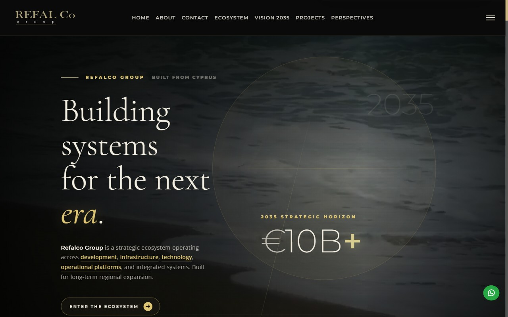

# Nexus AI — Maintenance & Deployment Handoff

**Site:** https://hasanjahoush.com/  
**Studio:** Nexus AI — Hasan Jahoush, Nicosia, Cyprus + remote  
**Last updated:** 2026-06-01

---

## 1. What this site is

A static, multi-page services site for Nexus AI — a Cyprus digital studio. It markets 8 services (web design, AI, SEO, content, social, automation, backend, branding) with a "brutalist engineering field manual" aesthetic: dark warm near-black background, gold (#E0A23A / `oklch(0.82 0.135 78)`) as the sole accent colour, and three fonts (Archivo Black, Manrope, JetBrains Mono).

**There is no build step.** The site is plain HTML + CSS + vanilla JavaScript. No Node, no bundler, no transpilation. Files are served exactly as they exist on disk.

### Pages

| File | Purpose |
|---|---|
| `index.html` | Homepage — hero, services spec sheet, system map, process, proof, CTA |
| `services.html` | Full service descriptions with deep-link anchors |
| `workflows.html` | Automation workflow showcase |
| `proof.html` | Work examples — featured project + proof grid |
| `insights.html` | Notes / editorial section |
| `contact.html` | Booking page — email, WhatsApp, phone, LinkedIn |
| `Hasan_Jahoush_CV.html` | CV (standalone) |

### Stack

| Layer | Implementation |
|---|---|
| Markup | Plain HTML5 |
| Styles | `css/style.css` (hand-written) + Bootstrap 5.1.3 (CDN) |
| Icons | Font Awesome 6.5.2 (CDN) |
| Fonts | Google Fonts CDN — Archivo Black, Manrope, JetBrains Mono |
| Interactivity | Vanilla JS — no frameworks, no npm packages |
| Hosting | Static host (currently Vercel) |

---

## 2. Running locally

No install required. Open a terminal in the project root and run:

```bash
python -m http.server 8000
```

Then open **http://127.0.0.1:8000/** in your browser.

> Why a server and not just double-clicking the file? The browser blocks some features (like canvas `willReadFrequently`) when files are loaded via `file://`. A local server avoids that.

If Python isn't available, any static server works:

```bash
# Node (npx, no install)
npx serve .

# VS Code: install "Live Server" extension, right-click index.html → Open with Live Server
```

---

## 3. How to edit common things

### 3a. The status ticker

The scrolling bar at the very top of every page. Each page has its own ticker text.

**File:** the `.html` file for that page (e.g. `index.html`)

The ticker is always two identical `<span class="ticker-inner">` elements inside `.ticker-track` — the second is a duplicate for seamless looping (marked `aria-hidden="true"`). Edit both spans to keep them in sync.

```html
<!-- index.html — find this block and edit the text in both spans -->
<div class="ticker-track">
  <span class="ticker-inner">SYS: ONLINE — STUDIO: JAHOUSE NEXUS — SERVICES: 08 ACTIVE — WORKFLOWS MAPPED: <b>47</b> — MANUAL STEPS REMOVED: <b data-steps>312</b> — NEXT SLOT: OPEN — LOC: NICOSIA/CY — REMOTE: YES — STATUS: ACCEPTING PROJECTS —&nbsp;&nbsp;//&nbsp;&nbsp;</span>
  <span class="ticker-inner" aria-hidden="true">SYS: ONLINE — …same text…</span>
</div>
```

The `<b data-steps>312</b>` value is overwritten at runtime by `script/site.js` with a value in the 290–340 range so it "feels live". To make it truly static, remove the `data-steps` attribute and put the fixed number directly as text.

---

### 3b. A service entry

Each service appears in three places. Update all three to keep things consistent.

**Place 1 — `index.html` spec rows** (the numbered list on the homepage)

Find the `.spec-row` block for the service (they each have a comment-visible index like `<span class="idx">01</span>`):

```html
<div class="spec-row">
  <span class="idx">01</span>
  <div class="spec-main">
    <h3><a href="services.html#web-design">Web Design &amp; Development</a></h3>
    <p>Fast, mobile-first sites that make your offer, trust signals, and contact paths obvious.</p>
  </div>
  <div class="spec-meta">
    <span class="metric">Live in weeks, not months</span>
    <a class="book-link" href="contact.html?service=web-design">→ Book</a>
  </div>
  <a class="spec-book-mobile" href="contact.html?service=web-design">Book this <i class="fa-solid fa-arrow-right"></i></a>
</div>
```

**Place 2 — `services.html` page cards** (the detailed descriptions)

Find the `<article class="page-card" id="web-design">` block and edit the `<h2>`, `<p>`, and `<ul>` items inside it.

**Place 3 — `script/orbit.js` DATA array** (the interactive system map)

Find the matching entry in the `DATA` array near the top of the file:

```js
var DATA = [
  { id: 1, label: "Web Design", cat: "BUILD", icon: "fa-display",
    desc: "Fast, mobile-first sites that make the offer, trust, and contact path obvious.",
    related: [2, 4], slug: "web-design" },
  // ... 7 more entries
];
```

- `label` — short name shown on the orbit node
- `desc` — tooltip description when the node is tapped
- `related` — array of `id` numbers that this service pairs with (affects the "Pairs with" line)
- `slug` — must match the `?service=` query param and the `id` attribute in `services.html`

**Also check:** the footer service links in each `.html` file (`.site-footer` section — "Services" column).

---

### 3c. The hero headline

**File:** `index.html`

```html
<h1 class="hero-title">Built.<br>Seen.<br><span class="hl">Proven.</span></h1>
```

The `<span class="hl">` wraps the gold-highlighted last word. Move it to whichever word you want highlighted, or remove it for a plain headline.

The hero sub-copy immediately follows:

```html
<p class="hero-subcopy">Nexus AI is a Cyprus digital studio. …</p>
```

---

### 3d. The gold brand colour

All colour is defined as CSS custom properties in one place.

**File:** `css/style.css` — the `:root` block at the very top

```css
:root {
  --accent:    oklch(0.82 0.135 78);   /* GOLD — links, ticker, focus */
  --accent-2:  oklch(0.70 0.115 74);
  --accent-bg: oklch(0.82 0.135 78 / 0.14);

  --warm:      oklch(0.82 0.135 78);   /* gold — CTA button fills */
  --warm-2:    oklch(0.88 0.13 82);    /* brighter gold on hover */
  --warm-ink:  oklch(0.17 0.03 75);    /* near-black text on gold (AAA contrast) */
}
```

`--accent` and `--warm` are the same value and are the primary gold. To change the brand colour, update both (and `--accent-2`, `--warm-2`, `--accent-bg`) in one pass.

The vapor tagline animation reads its colour from the HTML attribute `data-color` (RGB triplet, no `rgb()`):

```html
<!-- index.html -->
<div id="vapor" data-texts="We think.|You grow." data-color="224,162,58">
```

Update `data-color` to match any new gold value (e.g. `"200,150,40"`).

---

### 3e. Swapping the featured proof (Refalco)

The featured proof card appears in two places.

**Place 1 — `index.html`** (the `#proof` section)

```html
<a class="proof-featured" href="https://refalco.com/" target="_blank" rel="noreferrer">
  <div class="shot">
    
  </div>
  <div class="body">
    <span class="tag"><i class="fa-solid fa-circle" style="font-size:.5em"></i> Live in production</span>
    <h3>Refalco Group</h3>
    <p>A premium, multi-section corporate platform …</p>
    <span class="outcome">refalco.com ↗</span>
  </div>
</a>
```

**Place 2 — `proof.html`** — find the equivalent `.proof-featured` block and update it the same way.

**Image file:** `img/refalco.jpeg` — replace this file with a screenshot of the new featured project (keep the same filename, or update both `src` attributes). Recommended size: 1200 × 675 px (16:9), JPEG, optimised for web (aim under 200 KB).

---

## 4. Interactive features and their files

All four scripts are loaded at the bottom of each `.html` file with `defer` and are written as self-contained IIFEs. They degrade gracefully — if JS is disabled, or if the required DOM element is absent, the script exits silently.

**Every animation checks `prefers-reduced-motion: reduce`.** When the user has that OS setting enabled, animations are replaced with a static version or shown immediately.

| File | Feature | Trigger element |
|---|---|---|
| `script/bg.js` | Animated gold particle flow-field behind the hero | `<canvas id="hero-bg">` in `index.html` |
| `script/vapor.js` | Vaporise/re-materialise tagline cycle on the brand band | `<div id="vapor">` in `index.html` |
| `script/orbit.js` | Interactive radial "system map" — tap a service node to see its description | `<div id="orbit">` in `index.html` |
| `script/site.js` | Shared behaviour on every page: nav condense on scroll, scroll-reveal for `.js-reveal` elements, press-Enter-to-book shortcut, contact page `?service=` pre-fill | Runs on every page |

**Reduced-motion behaviour per script:**

- `bg.js` — renders a single static particle frame, no animation loop.
- `vapor.js` — shows the first phrase as a static render, no vaporise cycle.
- `orbit.js` — nodes appear at their positions without the rotation transition.
- `site.js` — scroll-reveal elements are revealed immediately (no fade-in); the Enter-key scroll uses `behavior: 'auto'` instead of `'smooth'`.

---

## 5. Contact routing

All contact links are plain HTML — no form backend, no server.

| Channel | How it works |
|---|---|
| Email | `<a href="mailto:jahousenexus@gmail.com">` — opens the user's email client |
| WhatsApp | `<a href="https://wa.me/0035799260049">` — opens WhatsApp chat |
| Phone | `<a href="tel:+35799260049">` — native call on mobile |
| LinkedIn | External link to profile |

**The `?service=` pre-fill** — every "Book this" link on `index.html` and `services.html` appends a query param, e.g. `contact.html?service=web-design`. When `contact.html` loads, `script/site.js` reads this param, looks it up in a name map, and:

1. Populates any `[data-service-name]` element with the full service name.
2. Updates the `[data-service-mail]` email `href` to include the service in the subject line.
3. Un-hides the `[data-service-slot]` readout at the top of the page.

To add a new service slug, update the `names` object in `script/site.js`:

```js
var names = {
  "web-design": "Web Design & Development",
  "ai-solutions": "AI Solutions",
  // add new slugs here
};
```

---

## 6. Deployment

The site is a static bundle — it can be hosted on Vercel, Netlify, Cloudflare Pages, or any static file host. There is no build command.

**Important: auto-deploy from git pushes is intentionally disabled.** Deploys are triggered manually only. This ensures the live site is never updated by an accidental push.

### Manual deploy via Vercel CLI

```bash
# Link the project (one-time, already done)
vercel link

# Deploy to production
vercel --prod
```

### Post-deploy checklist

After every deploy, confirm all five:

- [ ] `https://hasanjahoush.com/` returns HTTP 200 (`curl -s -o /dev/null -w "%{http_code}" https://hasanjahoush.com/`)
- [ ] Homepage loads with no JS console errors
- [ ] The gold ticker is visible and scrolling
- [ ] `contact.html?service=web-design` shows "SELECTED SERVICE: Web Design & Development" at the top
- [ ] Images load (hero, proof cards, `img/refalco.jpeg`)

### Hosting requirements

- Static file serving only (no server-side code).
- HTTPS (Vercel provides this automatically).
- All CDN assets (Bootstrap, Font Awesome, Google Fonts) are loaded from external CDNs — the host does not need to serve them.

---

## 7. Accessibility and SEO

### Accessibility

- **Skip link** — every page has `<a class="skip-link" href="#...">Skip to …</a>` as the first interactive element. It becomes visible on keyboard focus, letting keyboard users skip the nav.
- **Colour contrast** — gold (`--accent` / `oklch(0.82 0.135 78)`) on the dark background (`oklch(0.11 0.008 80)`) meets WCAG AA. The near-black ink (`--warm-ink`) on gold CTA buttons meets WCAG AAA. Do not lower the gold lightness or raise the background lightness without re-checking contrast.
- **Reduced-motion** — all four JS scripts respect `prefers-reduced-motion: reduce` (see section 4).
- **ARIA** — the ticker has `role="status"`, the orbit has `role="group"`, the duplicate ticker span has `aria-hidden="true"`. Maintain these when copying sections.
- **Semantic HTML** — sections use `<section aria-labelledby>`, articles use `<article>`, the hero uses `<header>`. Don't replace these with generic `<div>` elements.

### SEO

- **`sitemap.xml`** — in the project root. Update the `<lastmod>` dates when pages are substantially edited.
- **`robots.txt`** — in the project root. Currently allows all crawlers.
- **Canonical tags** — each page has `<link rel="canonical" href="https://hasanjahoush.com/page.html">`. Update the canonical if you add new pages.
- **JSON-LD structured data** — `index.html` contains a `<script type="application/ld+json">` block with `@type: "ProfessionalService"` schema. It includes the business name, address, phone, email, LinkedIn, and the full service catalog. Update this if contact details change.

```json
{
  "@context": "https://schema.org",
  "@type": "ProfessionalService",
  "name": "Nexus AI",
  "telephone": "+35799260049",
  "email": "mailto:jahousenexus@gmail.com",
  "address": { "addressLocality": "Nicosia", "addressCountry": "Cyprus" }
}
```

- **Open Graph / Twitter cards** — each page has `og:title`, `og:description`, `og:image` meta tags for social sharing previews. The OG image is `https://hasanjahoush.com/img/profile.jpg`.
- **Meta descriptions** — each page has a unique `<meta name="description">`. Keep these under 155 characters and specific to the page.

---

## 8. File structure reference

```
portfolio3/
├── index.html          # Homepage
├── services.html       # Service detail page
├── workflows.html      # Workflow showcase
├── proof.html          # Work proof / portfolio
├── insights.html       # Notes / editorial
├── contact.html        # Booking / contact
├── Hasan_Jahoush_CV.html
├── sitemap.xml
├── robots.txt
├── css/
│   └── style.css       # All custom styles — design tokens in :root
├── script/
│   ├── site.js         # Shared: nav, reveal, Enter shortcut, contact pre-fill
│   ├── bg.js           # Hero particle field
│   ├── orbit.js        # Services system map orbit
│   └── vapor.js        # Tagline vaporise animation
└── img/
    ├── profile.jpg     # OG image
    ├── icon.png        # Favicon
    ├── refalco.jpeg    # Featured proof screenshot
    └── p2.png … p4.png # Proof grid thumbnails
```

---

## 9. What to avoid

- **Do not add teal or cyan** — teal was explicitly removed because it reads as another brand's colour. The only accent is gold.
- **Do not introduce a build step** without updating this document and the deployment procedure.
- **Do not edit the CDN versions** of Bootstrap, Font Awesome, or Google Fonts. Update version numbers in the `<link>` and `<script>` tags in every `.html` file if you need to upgrade.
- **Do not push to `main` directly** — use feature branches and a pull request.
- **Do not enable auto-deploy** on the Vercel project — deploys are intentionally manual.
